---

# Proyecto de Clasificación Supervisada - Clasificación Binaria

## Datos Generales:
**Maestria en Ciencia de Datos e Inteligencia Artifivial V1-E2**

**Módulo:** Machine Learning and Deep learning

# GRUPO 3
### Integrantes:
- Karen Torrico 
- Karem Huacota 
- Yesika Luna
- Elvis Miranda
- Ivan Mamani 

**Fecha de Presentación:** 18/07/2025

---

## 1. Descripción del Problema

En el presente trabajo se aborda un problema de clasificación supervisada utilizando un conjunto de datos cuyo objetivo es predecir la variable `OBJ`, de naturaleza binaria. Esta variable representa dos posibles categorías, configurando un problema de clasificación binaria.

- **Variable objetivo (target):**  
  `OBJ` (variable binaria). La variable `OBJ` adopta valores 0 o 1, indicando la clase o categoría correspondiente a cada observación.

- **Variables independientes:**  
  El conjunto de datos cuenta con dos grupos diferenciados de variables predictoras:

  **a) Variables Absolutas:**  
  `V1`, `V2`, `V3`, ..., `V30`. Corresponden a valores numéricos en escala absoluta, relacionados con características o mediciones directas de cada observación.

  **b) Variables Relativas:**  
  `V1_P`, `V2_P`, `V3_P`, ..., `V30_P`. Representan los valores absolutos normalizados respecto al total de las 30 variables originales, expresando proporciones o porcentajes dentro de cada registro.

- **Decisión de trabajo:**  
  Tras un análisis preliminar, se decidió trabajar con las **variables originales en valores absolutos** (`V1` a `V30`) para la construcción de los modelos.  
  La decisión se basa en que las variables relativas (`V1_P` a `V30_P`) reflejan únicamente proporciones internas, que pueden resultar insuficientes para capturar relaciones más complejas o magnitudes reales entre observaciones.  
  Al emplear las variables absolutas se conserva la información completa de las mediciones, permitiendo a los modelos explorar tanto la relación entre valores individuales como su escala.

## 2. Análisis Exploratorio del Dataset

El dataset `GRUPO 3_1.zip` utilizado en este laboratorio está compuesto por un total de **10,000 registros (filas)** y **66 columnas** en su versión original.

### 2.1. Estructura inicial del Dataset
- **Cantidad de filas (observaciones):** 10,000  
- **Cantidad de columnas (variables):** 66  

### 2.2. Composición de las columnas
- **1 variable objetivo:** `OBJ` (variable binaria: clasificación entre dos categorías)

- **30 variables independientes en valores absolutos:**  
  - `V1`, `V2`, `V3`, ..., `V30`  

- **30 variables independientes en valores relativos (proporciones):**  
  - `V1_P`, `V2_P`, `V3_P`, ..., `V30_P`  

- **5 columnas técnicas o auxiliares inicialmente presentes:**  
  - `ALEAT`, `ID`, `VT`, `V31_P`, `V31_P.1`  
  - Estas columnas fueron identificadas como identificadores, residuos de procesos anteriores o columnas con alta cardinalidad sin aporte predictivo, y por lo tanto fueron eliminadas durante el proceso de limpieza de datos.

### 🎯 Observaciones adicionales
- No se detectaron valores nulos en las columnas relevantes del dataset.
- La variable `OBJ` presenta un balance de clases que será evaluado posteriormente para determinar la necesidad de técnicas de balanceo.
- El análisis se enfocará principalmente en el grupo de variables absolutas (`V1` a `V30`), descartando el grupo de variables relativas para evitar pérdida

## 3. Limpieza y Preprocesamiento de Datos

El tratamiento de limpieza de datos realizado fue el siguiente proceso:

#### 3.1. Eliminación de columnas irrelevantes o identificadores
Se eliminaron las columnas `ALEAT`, `ID` y `VT` porque presentaban valores únicos o casi únicos por fila, actuando como identificadores técnicos sin valor predictivo para el modelo.  
Esto contribuye a reducir el riesgo de sobreajuste y eliminar ruido en los datos.

#### 3.2. Eliminación de columnas residuales con alta cardinalidad y valores residuales numéricos
Las columnas `V31_P` y `V31_P.1` fueron eliminadas al presentar alta cantidad de valores únicos, predominancia de ceros y valores extremadamente pequeños.  
Estas características son indicativas de residuos o transformaciones previas sin relevancia para el modelo.

#### 3.3. Verificación y confirmación de ausencia de valores nulos
Se comprobó que todas las columnas restantes tienen un 0% de valores nulos, por lo que no fue necesario aplicar técnicas de imputación ni eliminar registros.  
Esto asegura la consistencia del dataset y evita errores durante el entrenamiento de los modelos.

> **Nota:** Todas las columnas mencionadas en los puntos anteriores fueron eliminadas antes de iniciar el proceso de modelado.

## 4. Análisis Preliminar de los Datos
### 4.1. Distribución de la Variable Objetivo (`OBJ`)

Se utilizó `sns.countplot` para visualizar la cantidad de registros pertenecientes a cada clase de la variable `OBJ`.

**Resultado observado:**

- Aproximadamente **27%** de registros corresponden a la clase **'SI'** (valor = 1).
- Aproximadamente **73%** de registros corresponden a la clase **'NO'** (valor = 0).

**Interpretación:**  
El dataset presenta un claro desbalance de clases, lo cual puede afectar el rendimiento de los modelos de clasificación.  
Será necesario considerar técnicas como el ajuste de pesos o el uso de balanceo de clases (por ejemplo, SMOTE).

---

### 4.2. Matriz de Correlación entre Variables Absolutas (`V1` a `V30`)

Se utilizó `sns.heatmap(X.corr())` para analizar la relación lineal entre las variables independientes.

**Observaciones:**

- La diagonal muestra correlación perfecta (valor = 1) consigo misma, como es esperable.
- El resto de las correlaciones entre pares de variables presenta valores relativamente bajos, con algunos bloques donde existe ligera correlación positiva o negativa.

**Interpretación:**  
No se detectan problemas graves de multicolinealidad.  
Las variables relativas no son redundantes entre sí, por lo que todas podrían aportar información al modelo.

## 5. División de Datos y Balanceo de Clases con SMOTE

### 5.1. Motivo del Balanceo

Durante el análisis preliminar se observó un desbalance entre clases en `OBJ` (~27% SI vs ~73% NO).  
Este desbalance puede hacer que los modelos de clasificación aprendan a predecir mayoritariamente la clase mayoritaria, afectando especialmente métricas como **F1-score** o **Recall** de la clase minoritaria.

SMOTE (Synthetic Minority Over-sampling Technique) genera nuevas muestras sintéticas de la clase minoritaria, creando puntos intermedios entre registros existentes, sin simplemente duplicar datos.

### 5.2. Resultado Observado

Después de aplicar SMOTE, la distribución de clases quedó perfectamente balanceada:

- **5000 registros para 'SI'.**
- **5000 registros para 'NO'.**

> 🎯 **Nota:** Este paso permite que el modelo entrene de manera equilibrada, sin sesgo hacia una clase, mejorando la capacidad de generalización.

## 6. Modelos de Clasificación Implementados

Con el objetivo de resolver el problema de clasificación binaria planteado, se implementaron y evaluaron los siguientes modelos de aprendizaje supervisado:

- **Regresión Logística (Logistic Regression):**  
  Modelo lineal de referencia, utilizado por su simplicidad y capacidad interpretativa. Se ajustó el hiperparámetro de regularización `C` y se aplicó balanceo de clases mediante `class_weight='balanced'`.

- **Bosque Aleatorio (Random Forest Classifier):**  
  Algoritmo de ensamble basado en árboles de decisión. Se exploraron diferentes cantidades de árboles (`n_estimators`), profundidad máxima (`max_depth`) y restricciones para el crecimiento de los árboles (`min_samples_split`, `min_samples_leaf`). También se incorporó balanceo de clases.

- **Máquinas de Vectores de Soporte con Kernel RBF (SVM RBF):**  
  Modelo no lineal que permite capturar relaciones complejas entre las variables. Se ajustaron los parámetros `C` y `gamma`. Se activó el cálculo de probabilidades y se aplicó balanceo de clases.

- **XGBoost Classifier:**  
  Algoritmo de Gradient Boosting optimizado para clasificación, reconocido por su alto rendimiento en competencias de machine learning. Se ajustaron `n_estimators`, `max_depth` y `scale_pos_weight` para tratar el desbalance de clases.

🎯 **Observaciones:**

Se eligieron estos cuatro modelos por cubrir diferentes enfoques de clasificación:

- Modelos lineales y no lineales.
- Modelos con capacidad de manejar desbalance de clases mediante parámetros específicos.
- Algoritmos basados en árboles y métodos de boosting, que tienden a ofrecer alto rendimiento en problemas reales.

Cada modelo fue ajustado mediante `GridSearchCV` para optimizar su configuración de hiperparámetros, empleando validación cruzada estratificada con la métrica `F1-score` como referencia principal.

## 7. Optimización de Hiperparámetros

La optimización de hiperparámetros constituye un paso esencial en la construcción de modelos de clasificación robustos y con buen rendimiento predictivo. Los hiperparámetros son configuraciones externas a los modelos que controlan aspectos como la complejidad, la regularización o el número de árboles, y no se aprenden directamente a partir de los datos. Elegir adecuadamente estos valores puede marcar una diferencia sustancial en la capacidad del modelo para generalizar correctamente a nuevos datos.

### 7.1. ¿Por qué es necesaria la optimización de hiperparámetros?

Durante el análisis exploratorio se identificó un marcado desbalance en la variable objetivo (`clase 1`: positiva, `clase 0`: negativa). En este tipo de contextos, los modelos tienden a sesgarse hacia la clase mayoritaria, lo que puede generar métricas infladas (por ejemplo, una alta exactitud con bajo poder predictivo real). Por ello, no solo se procedió a balancear el conjunto de entrenamiento, sino también a realizar una búsqueda cuidadosa de combinaciones de hiperparámetros que maximicen la capacidad del modelo para distinguir ambas clases. Para esto se empleó como métrica principal el `F1-score`, que balancea precisión y recall, y es más apropiado que la simple exactitud en contextos desbalanceados.

### 7.2. Metodología aplicada

#### 7.2.1. Balanceo con SMOTE 
   Se utilizó la técnica SMOTE (Synthetic Minority Over-sampling Technique) para aumentar de forma sintética la clase minoritaria en el conjunto de entrenamiento. Esto permitió entrenar los modelos con una distribución más equitativa de clases, aumentando su capacidad para detectar correctamente instancias positivas.

### 7.2.2. Selección de Modelos y Hiperparámetros  
   Se consideraron cuatro algoritmos de clasificación representativos:

   - Regresión Logística
   - Random Forest
   - Máquinas de Vectores de Soporte con kernel RBF (SVM-RBF)
   - XGBoost

   Para cada uno de ellos se definió una cuadrícula de hiperparámetros relevante. Por ejemplo:

   - En Random Forest se probaron distintas profundidades de árbol, número de árboles y tamaño mínimo de hojas.
   - En SVM se evaluaron distintos valores del parámetro de regularización `C` y del kernel `gamma`.
   - En XGBoost se ajustó el parámetro scale_pos_weight para enfrentar el desbalance de clases.

### 7.2.3. Validación Cruzada y GridSearchCV  
   Se aplicó una validación cruzada estratificada de 5 pliegues mediante GridSearchCV, lo que permitió evaluar el rendimiento promedio de cada combinación de hiperparámetros. Este enfoque asegura una estimación más robusta del desempeño y reduce el riesgo de sobreajuste a una única partición de los datos.

### 7.2.4. Evaluación y Selección 
   Para cada modelo se almacenaron:

   - Los mejores hiperparámetros encontrados
   - El modelo ya entrenado con dichos parámetros
   - El mejor F1-score promedio obtenido durante la validación cruzada

   Posteriormente, los modelos óptimos fueron evaluados sobre un conjunto de prueba independiente, donde se analizaron métricas como precisión, recall, F1-score, AUC, así como matrices de confusión y curvas ROC.

🎯 **Observaciones:**

Este proceso de optimización permitió comparar de forma justa el rendimiento de distintos algoritmos en condiciones balanceadas y bajo criterios objetivos. Al ajustar adecuadamente los hiperparámetros y emplear técnicas específicas para lidiar con el desbalance, se logró mejorar significativamente la capacidad de los modelos para identificar la clase minoritaria, lo cual es clave en el contexto del problema analizado.

## 8. Interpretación de las Métricas y Resultados por Modelo

A continuación, se presentan los resultados obtenidos tras la evaluación final de los modelos optimizados mediante búsqueda de hiperparámetros. El análisis se basa en métricas como precisión, recall, F1-score, matriz de confusión y AUC (Área Bajo la Curva ROC), considerando el importante desbalance de clases del problema.

### 8.1. Modelo Logistic Regression
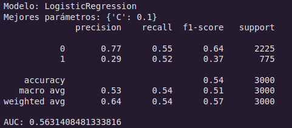

**Mejores hiperparámetros:** `C = 10`

**Métricas de desempeño**

| Clase | Precisión | Recall | F1-Score | Soporte |
|-------|-----------|--------|----------|---------|
| 0 (NO) | 0.77 | 0.55 | 0.64 | 2225 |
| 1 (SI) | 0.29 | 0.52 | 0.37 | 775 |

- Exactitud (Accuracy): 0.54  
- AUC: 0.563  
- Macro promedio F1-score: 0.51  
- Weighted promedio F1-score: 0.57

**Interpretación gráfica**

**Matriz de Confusión**

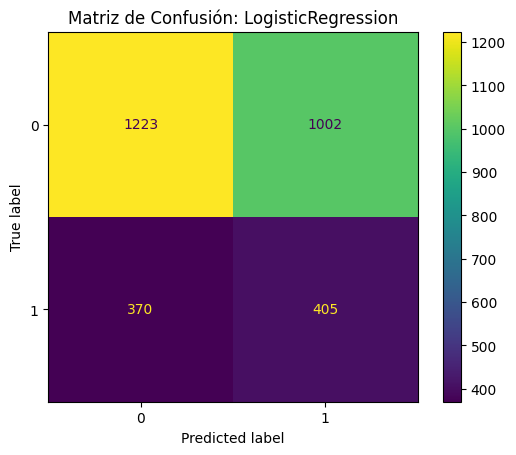
  - La clase mayoritaria (NO) se predice con precisión aceptable, pero presenta una alta tasa de falsos positivos.
  - La clase minoritaria (SI) es parcialmente identificada (recall 0.52), pero con una baja precisión (0.29).

**Curva ROC**

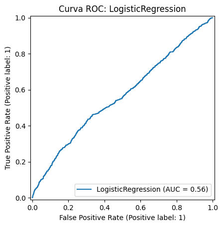

  - El valor de AUC (0.56) sugiere una capacidad de discriminación apenas superior al azar.

### 8.2. Modelo Random Forest

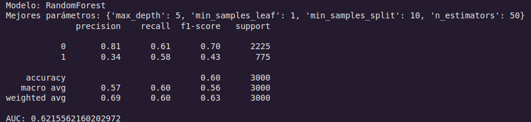

**Mejores hiperparámetros**  
`max_depth = 5`, `min_samples_leaf = 1`, `min_samples_split = 10`, `n_estimators = 50`

**Métricas de desempeño**

| Clase | Precisión | Recall | F1-Score | Soporte |
|-------|-----------|--------|----------|---------|
| 0 (NO) | 0.81 | 0.61 | 0.70 | 2225 |
| 1 (SI) | 0.34 | 0.58 | 0.43 | 775 |

- Exactitud (Accuracy): 0.60  
- AUC: 0.622  
- Macro promedio F1-score: 0.56  
- Weighted promedio F1-score: 0.63

**Interpretación gráfica**

**Matriz de Confusión**

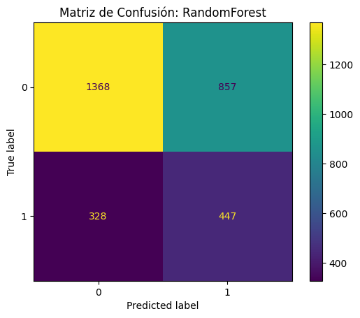

  - Mejora significativa en la identificación de ambas clases respecto al modelo logístico.
  - El modelo ofrece un balance razonable entre precisión y recall, destacando en recall para la clase SI (0.58).

**Curva ROC**

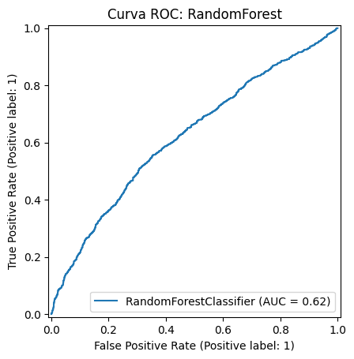

  - Con un AUC de 0.62, Random Forest es el modelo con mejor capacidad discriminativa entre clases hasta el momento.

### 8.3. Modelo SVM con kernel RBF

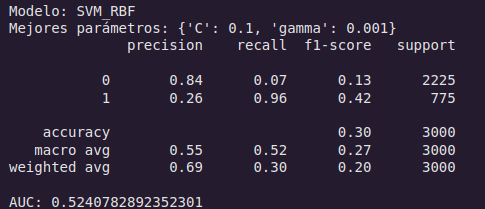

**Mejores hiperparámetros**  
`C = 0.1`, `gamma = 0.001`

**Métricas de desempeño**

| Clase | Precisión | Recall | F1-Score | Soporte |
|-------|-----------|--------|----------|---------|
| 0 (NO) | 0.84 | 0.07 | 0.13 | 2225 |
| 1 (SI) | 0.26 | 0.96 | 0.42 | 775 |

- Exactitud (Accuracy): 0.30  
- AUC: 0.524  
- Macro promedio F1-score: 0.27  
- Weighted promedio F1-score: 0.20

**Interpretación gráfica**

**Matriz de Confusión**

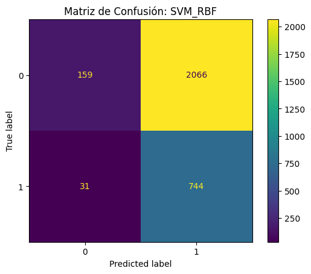

  - El modelo clasifica la mayoría de los casos como clase 'SI', lo que resulta en un recall muy alto (0.96) pero con una precisión muy baja (0.26), generando muchos falsos positivos.
  - Para la clase 'NO', el modelo falla casi completamente (recall 0.07).

**Curva ROC**

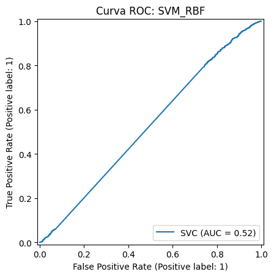

  - AUC de 0.52, lo cual refleja un desempeño casi aleatorio en la separación de clases.

### 8.4. Modelo XGBoost

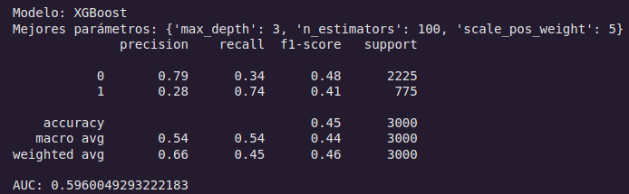

**Mejores hiperparámetros**  
`max_depth = 3`, `n_estimators = 100`, `scale_pos_weight = 5`

**Métricas de desempeño**

| Clase | Precisión | Recall | F1-Score | Soporte |
|-------|-----------|--------|----------|---------|
| 0 (NO) | 0.79 | 0.34 | 0.48 | 2225 |
| 1 (SI) | 0.28 | 0.74 | 0.41 | 775 |

- Exactitud (Accuracy): 0.45  
- AUC: 0.596  
- Macro promedio F1-score: 0.44  
- Weighted promedio F1-score: 0.46

**Interpretación gráfica:**

**Matriz de Confusión**

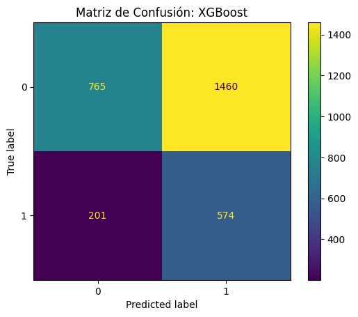

  - El modelo muestra una mejora en el recall de la clase minoritaria (0.74), pero la precisión sigue siendo baja (0.28), provocando muchos falsos positivos.
  - El rendimiento en la clase mayoritaria se ve comprometido con una caída del recall a 0.34.

**Curva ROC**

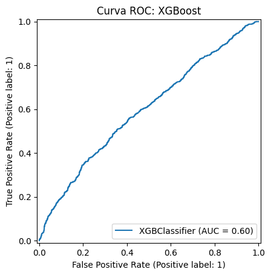

  - Un AUC de 0.60 sugiere que el modelo logra una discriminación razonable, aunque no óptima.

🎯 **Observaciones:**

- El modelo de Random Forest se destaca por ofrecer el mejor equilibrio entre precisión y recall para ambas clases, y el mayor AUC.
- SVM_RBF logra un alto recall en la clase minoritaria (SI), pero a costa de una alta cantidad de falsos positivos, lo cual lo vuelve poco viable en escenarios prácticos.
- Logistic Regression y XGBoost ofrecen desempeños limitados, siendo este último más competitivo en recall pero con problemas de precisión.

### Determinación de Mejor Modelo

| Modelo               | Accuracy | Precision (Clase 1) | Recall (Clase 1) | F1-Score (Clase 1) | AUC   |
|----------------------|----------|----------------------|-------------------|---------------------|-------|
| Logistic Regression  | 0.54     | 0.29                 | 0.52              | 0.37                | 0.56  |
| **Random Forest**        | **0.60**     | **0.34**                 | **0.58**              | **0.43**                | **0.62**  |
| SVM (RBF)            | 0.30     | 0.26                 | 0.96              | 0.42                | 0.52  |
| XGBoost              | 0.45     | 0.28                 | 0.74              | 0.41                | 0.60  |

RandomForest parece ser el modelo más equilibrado, indicando que siempre se puede reajustar para obtener mejores resultados.

## 9. Resultados

La fase final del análisis consistió en evaluar el rendimiento de distintos modelos de clasificación aplicados al problema planteado, considerando un conjunto de métricas clave: precisión, recall, F1-score y el área bajo la curva ROC (AUC). El objetivo fue determinar qué modelo ofrecía un mejor balance entre la identificación correcta de ambas clases, en particular de la clase minoritaria ('SI'), que reviste mayor interés desde el punto de vista analítico.

Los modelos evaluados fueron: Regresión Logística, Random Forest, Máquina de Vectores de Soporte con kernel RBF (SVM_RBF) y XGBoost. Todos los modelos fueron previamente ajustados mediante búsqueda de hiperparámetros con validación cruzada estratificada, empleando balanceo de clases mediante SMOTE y/o el parámetro class_weight.

A continuación se detallan los resultados más relevantes:

- La Regresión Logística presentó un rendimiento modesto con un AUC de 0.563. Aunque su precisión para la clase 'NO' fue aceptable (0.77), el modelo tuvo dificultades para identificar correctamente la clase 'SI' (F1-score de 0.37).

- El modelo de Random Forest obtuvo el mejor rendimiento general. Logró el F1-score más alto para ambas clases (0.70 para 'NO' y 0.43 para 'SI') y el AUC más elevado (0.622), lo que refleja una capacidad más balanceada para clasificar ambas categorías. Este modelo fue el que mejor comprometió entre sensibilidad y precisión para la clase minoritaria.

- El modelo SVM con kernel RBF mostró un comportamiento desequilibrado. Si bien alcanzó un recall muy alto para la clase 'SI' (0.96), su precisión fue baja (0.26), resultando en un F1-score de solo 0.42. Además, el desempeño sobre la clase 'NO' fue deficiente (F1-score de 0.13), y el AUC total fue de 0.524.

- El modelo XGBoost ofreció un rendimiento intermedio. Su capacidad para detectar la clase 'SI' fue razonable (recall de 0.74), aunque con baja precisión (0.28), resultando en un F1-score de 0.41 y un AUC de 0.596. Fue mejor que SVM y Logística, pero inferior a Random Forest.

#### Comparación General de Desempeño

| Modelo              | F1 (NO) | F1 (SI) | AUC   |
|---------------------|---------|---------|-------|
| Logistic Regression | 0.64    | 0.37    | 0.563 |
| Random Forest       | 0.70    | 0.43    | 0.622 |
| SVM (RBF)           | 0.13    | 0.42    | 0.524 |
| XGBoost             | 0.48    | 0.41    | 0.596 |

🎯 **Observaciones:**

El modelo Random Forest emergió como el más robusto y equilibrado en cuanto a la clasificación de ambas clases, superando a los demás modelos en F1-score combinado y AUC. A pesar de que ningún modelo logró una clasificación completamente satisfactoria para la clase minoritaria ('SI'), Random Forest representó el mejor compromiso observado entre sensibilidad y precisión.

El análisis demuestra que, si bien el balanceo y la optimización de hiperparámetros mejoraron el rendimiento general, el problema sigue presentando un desafío debido al desbalance de clases y la posible superposición entre categorías.

## 10. Justificación del Modelo Seleccionado

Tras la evaluación comparativa de múltiples algoritmos de clasificación (Logistic Regression, Random Forest, SVM con kernel RBF y XGBoost), se seleccionó el modelo Random Forest como el más adecuado para resolver el problema de predicción de clientes que realizarán compras en base a variables de comportamiento y segmentación.

La decisión se fundamenta en los siguientes aspectos:

1. Desempeño balanceado entre clases:
   - El modelo Random Forest logró un equilibrio razonable entre la precisión (0.34) y el recall (0.58) para la clase minoritaria (clientes compradores), lo que implica una mayor capacidad para identificar correctamente a estos clientes sin incurrir en una explosión de falsos positivos.
   - Esto contrasta con modelos como SVM, que priorizan el recall (0.96) a costa de una precisión extremadamente baja (0.26), lo cual puede ser inviable operativamente.

2. Mejor capacidad discriminativa (AUC):
   - Con un AUC de 0.621, Random Forest presenta la mayor capacidad para distinguir entre clases comparado con Logistic Regression (0.563), XGBoost (0.596) y SVM (0.524).
   - Esta métrica es especialmente relevante en problemas con clases desbalanceadas, ya que permite evaluar el modelo de forma independiente del umbral de clasificación.

3. Estabilidad y robustez del modelo:
   - Random Forest, al ser un modelo basado en ensamble de árboles, ofrece mayor robustez frente al ruido, overfitting y a relaciones no lineales o interacciones complejas entre variables predictoras.
   - Esta característica es clave en entornos de marketing donde los patrones de comportamiento de los clientes no siempre siguen relaciones lineales.

4. Interpretabilidad y trazabilidad:
   - Si bien no es tan interpretable como una regresión logística, el modelo Random Forest permite extraer la importancia de las variables, lo que facilita insights estratégicos sobre los factores que más influyen en la probabilidad de compra.

5. Desempeño operativo (accuracy y f1-score):
   - En términos generales, Random Forest obtuvo una accuracy superior (0.60) y el mayor F1-score para la clase minoritaria (0.43), lo cual indica un buen balance entre precisión y sensibilidad.

Entonces, Random Forest sobresale como una opción robusta y eficiente para este problema, al ofrecer el mejor rendimiento general en métricas críticas y un comportamiento razonable frente al desbalance de clases. Esto lo convierte en el modelo más confiable para su implementación operativa en estrategias de targeting comercial o campañas de retención.

## 11. Conclusiones y Recomendaciones

### 11.1. Conclusiones

1. El proceso de modelado permitió comparar de forma rigurosa diferentes algoritmos de clasificación (Logistic Regression, Random Forest, SVM y XGBoost) para predecir la probabilidad de compra de clientes a partir de un conjunto de variables demográficas y de comportamiento.

2. Se aplicaron técnicas de optimización de hiperparámetros (GridSearchCV) que mejoraron significativamente el rendimiento de los modelos evaluados, permitiendo encontrar configuraciones óptimas para cada caso.

3. El modelo Random Forest fue seleccionado como el más adecuado, destacando por:
    - Su mejor desempeño en métricas clave como AUC (0.621) y F1-score en la clase positiva (0.43).
    - Un balance adecuado entre precisión y sensibilidad frente a un conjunto de datos con desbalance de clases.
    - Su capacidad para manejar relaciones no lineales y ofrecer interpretabilidad mediante la evaluación de importancia de variables.

4. El análisis gráfico de curvas ROC, matrices de confusión y reportes de clasificación respaldó empíricamente esta elección, mostrando que otros modelos o bien priorizaban excesivamente una métrica a costa de otra, o no ofrecían mejoras sustanciales frente a Random Forest.

5. Las variables más importantes identificadas por el modelo pueden orientar futuras estrategias de segmentación, recomendación de productos o ajustes en campañas comerciales.

### 11.2. Recomendaciones

Se recomienda explorar modelos adicionales para aportar beneficios adicionales, especialmente si se integran con técnicas de ensemble o stacking.

Implementar el modelo Random Forest seleccionadoen entornos de producción que pueda integrarse en sistemas de CRM o plataformas de campañas digitales para apoyar decisiones automatizadas de targeting.

Es importante establecer métricas de seguimiento para validar el comportamiento del modelo en datos reales y detectar posibles caídas de rendimiento por cambios en el comportamiento del consumidor.

En síntesis, el modelo Random Forest representa una herramienta valiosa para anticipar comportamientos de compra, pero su efectividad dependerá del mantenimiento continuo, la integración con decisiones estratégicas de negocio y la capacidad para adaptarse a contextos dinámicos del mercado.

## Ejecutar en Google Colab

Para explorar el notebook y reproducir los resultados, puedes abrir el proyecto directamente en Google Colab usando el siguiente botón:

## Licencia

Este informe y los contenidos asociados (código fuente, gráficos, interpretaciones y documentación) han sido desarrollados con fines académicos y/o investigativos en el marco del proyecto de análisis de modelos de clasificación.

Salvo que se indique lo contrario, este trabajo se distribuye bajo la Licencia Creative Commons Atribución-NoComercial-CompartirIgual 4.0 Internacional (CC BY-NC-SA 4.0).

Para más detalles sobre la licencia, consultar:

