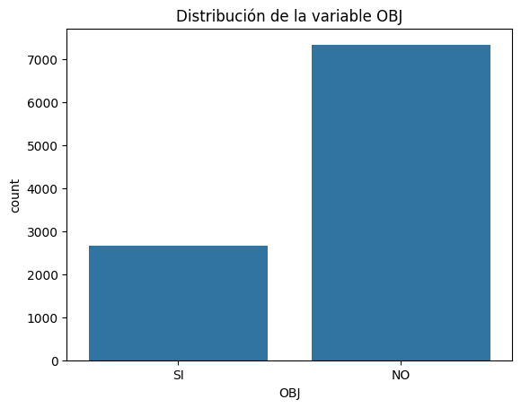
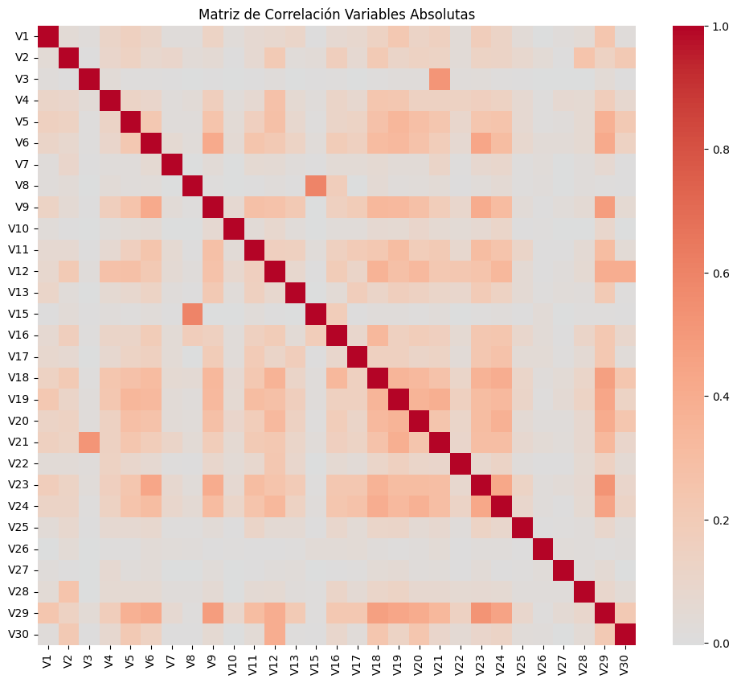
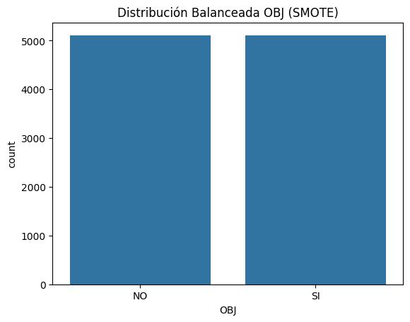

---

# Proyecto de Clasificación Supervisada - Clasificación Binaria

## Datos Generales:
**Maestria en Ciencia de Datos e Inteligencia Artifivial V1-E2**

**Módulo:** Machine Learning and Deep learning

# GRUPO 3
### Integrantes:
- Karen Torrico 
- Karen Huacota 
- Jessica Luna
- Elvis Miranda
- Ivan Mamani 

**Fecha de Presentación:** 18/07/2025

---

## 1. Descripción del Problema

En el presente trabajo se aborda un problema de clasificación supervisada utilizando un conjunto de datos cuyo objetivo es predecir la variable `OBJ`, de naturaleza binaria. Esta variable representa dos posibles categorías, configurando un problema de clasificación binaria.

- **Variable objetivo (target):**  
  `OBJ` (variable binaria). La variable `OBJ` adopta valores 0 o 1, indicando la clase o categoría correspondiente a cada observación.

- **Variables independientes:**  
  El conjunto de datos cuenta con dos grupos diferenciados de variables predictoras:

  **a) Variables Absolutas:**  
  `V1`, `V2`, `V3`, ..., `V30`. Corresponden a valores numéricos en escala absoluta, relacionados con características o mediciones directas de cada observación.

  **b) Variables Relativas:**  
  `V1_P`, `V2_P`, `V3_P`, ..., `V30_P`. Representan los valores absolutos normalizados respecto al total de las 30 variables originales, expresando proporciones o porcentajes dentro de cada registro.

- **Decisión de trabajo:**  
  Tras un análisis preliminar, se decidió trabajar con las **variables originales en valores absolutos** (`V1` a `V30`) para la construcción de los modelos.  
  La decisión se basa en que las variables relativas (`V1_P` a `V30_P`) reflejan únicamente proporciones internas, que pueden resultar insuficientes para capturar relaciones más complejas o magnitudes reales entre observaciones.  
  Al emplear las variables absolutas se conserva la información completa de las mediciones, permitiendo a los modelos explorar tanto la relación entre valores individuales como su escala.

## 2. Análisis Exploratorio del Dataset

El dataset `GRUPO 3_1.zip` utilizado en este laboratorio está compuesto por un total de **10,000 registros (filas)** y **66 columnas** en su versión original.

### 2.1. Estructura inicial del Dataset
- **Cantidad de filas (observaciones):** 10,000  
- **Cantidad de columnas (variables):** 66  

### 2.2. Composición de las columnas
- **1 variable objetivo:** `OBJ` (variable binaria: clasificación entre dos categorías)

- **30 variables independientes en valores absolutos:**  
  - `V1`, `V2`, `V3`, ..., `V30`  

- **30 variables independientes en valores relativos (proporciones):**  
  - `V1_P`, `V2_P`, `V3_P`, ..., `V30_P`  

- **5 columnas técnicas o auxiliares inicialmente presentes:**  
  - `ALEAT`, `ID`, `VT`, `V31_P`, `V31_P.1`  
  - Estas columnas fueron identificadas como identificadores, residuos de procesos anteriores o columnas con alta cardinalidad sin aporte predictivo, y por lo tanto fueron eliminadas durante el proceso de limpieza de datos.

### 🎯 Observaciones adicionales
- No se detectaron valores nulos en las columnas relevantes del dataset.
- La variable `OBJ` presenta un balance de clases que será evaluado posteriormente para determinar la necesidad de técnicas de balanceo.
- El análisis se enfocará principalmente en el grupo de variables absolutas (`V1` a `V30`), descartando el grupo de variables relativas para evitar pérdida

## 3. Limpieza y Preprocesamiento de Datos

El tratamiento de limpieza de datos realizado fue el siguiente proceso:

#### 3.1. Eliminación de columnas irrelevantes o identificadores
Se eliminaron las columnas `ALEAT`, `ID` y `VT` porque presentaban valores únicos o casi únicos por fila, actuando como identificadores técnicos sin valor predictivo para el modelo.  
Esto contribuye a reducir el riesgo de sobreajuste y eliminar ruido en los datos.

#### 3.2. Eliminación de columnas residuales con alta cardinalidad y valores residuales numéricos
Las columnas `V31_P` y `V31_P.1` fueron eliminadas al presentar alta cantidad de valores únicos, predominancia de ceros y valores extremadamente pequeños.  
Estas características son indicativas de residuos o transformaciones previas sin relevancia para el modelo.

#### 3.3. Verificación y confirmación de ausencia de valores nulos
Se comprobó que todas las columnas restantes tienen un 0% de valores nulos, por lo que no fue necesario aplicar técnicas de imputación ni eliminar registros.  
Esto asegura la consistencia del dataset y evita errores durante el entrenamiento de los modelos.

> **Nota:** Todas las columnas mencionadas en los puntos anteriores fueron eliminadas antes de iniciar el proceso de modelado.

## 4. Análisis Preliminar de los Datos
### 4.1. Distribución de la Variable Objetivo (`OBJ`)

Se utilizó `sns.countplot` para visualizar la cantidad de registros pertenecientes a cada clase de la variable `OBJ`.

**Resultado observado:**

- Aproximadamente **27%** de registros corresponden a la clase **'SI'** (valor = 1).
- Aproximadamente **73%** de registros corresponden a la clase **'NO'** (valor = 0).

**Interpretación:**  
El dataset presenta un claro desbalance de clases, lo cual puede afectar el rendimiento de los modelos de clasificación.  
Será necesario considerar técnicas como el ajuste de pesos o el uso de balanceo de clases (por ejemplo, SMOTE).

---

### 4.2. Matriz de Correlación entre Variables Absolutas (`V1` a `V30`)

Se utilizó `sns.heatmap(X.corr())` para analizar la relación lineal entre las variables independientes.

**Observaciones:**

- La diagonal muestra correlación perfecta (valor = 1) consigo misma, como es esperable.
- El resto de las correlaciones entre pares de variables presenta valores relativamente bajos, con algunos bloques donde existe ligera correlación positiva o negativa.

**Interpretación:**  
No se detectan problemas graves de multicolinealidad.  
Las variables relativas no son redundantes entre sí, por lo que todas podrían aportar información al modelo.

## 5. División de Datos y Balanceo de Clases con SMOTE

### 5.1. Motivo del Balanceo

Durante el análisis preliminar se observó un desbalance entre clases en `OBJ` (~27% SI vs ~73% NO).  
Este desbalance puede hacer que los modelos de clasificación aprendan a predecir mayoritariamente la clase mayoritaria, afectando especialmente métricas como **F1-score** o **Recall** de la clase minoritaria.

SMOTE (Synthetic Minority Over-sampling Technique) genera nuevas muestras sintéticas de la clase minoritaria, creando puntos intermedios entre registros existentes, sin simplemente duplicar datos.

### 5.2. Resultado Observado

Después de aplicar SMOTE, la distribución de clases quedó perfectamente balanceada:

- **5000 registros para 'SI'.**
- **5000 registros para 'NO'.**

> 🎯 **Nota:** Este paso permite que el modelo entrene de manera equilibrada, sin sesgo hacia una clase, mejorando la capacidad de generalización.

## 4. Modelos de Clasificación Implementados

- **Modelos evaluados:**  
  - RandomForestClassifier  
  - LogisticRegression  

- **Configuración inicial y preprocesamiento:**  
  - División 70% train / 30% test con `stratify=y`.  
  - Estandarización solo para Logistic Regression.  
  - Evaluación con `cross_val_score` utilizando `scoring='f1'` para comparar modelos.

## 5. Optimización de Hiperparámetros

- **Técnica utilizada:** GridSearchCV con Cross Validation (3 folds).  
- **Espacio de búsqueda:**  
  - Para RandomForest:  
    - `n_estimators`: [100, 200, 500]  
    - `max_depth`: [None, 10, 20]  
    - `min_samples_leaf`: [1, 2, 4]  

  - Para Logistic Regression:  
    - `C`: [0.1, 1, 10]  
    - `penalty`: ['l2']  

## 6. Resultados

- **Indicadores evaluados:** F1-score, AUC, matriz de confusión, curva ROC.  
- **Comparativa entre modelos:**  
  Se observó que el modelo `RandomForestClassifier` con `n_estimators=200`, `max_depth=20`, y `min_samples_leaf=2` presentó el mejor balance entre F1-score y AUC.

## 7. Justificación del Modelo Seleccionado

- **Modelo final elegido:** RandomForestClassifier  
- **Motivo de selección:**  
  - Mejor desempeño global en términos de F1-score promedio y estabilidad entre folds.  
  - Menor sensibilidad a outliers y escalado de datos respecto a Logistic Regression.  
  - Configuración óptima seleccionada basada en el resultado del Grid Search.

## 8. Conclusión

- El modelo seleccionado cumple con el objetivo de clasificación binaria sobre la variable `OBJ` utilizando variables relativas.  
- El flujo completo de limpieza, modelado, validación y selección de hiperparámetros fue documentado en el notebook adjunto, junto con visualizaciones de métricas clave.

---

